#  GigAtende

Uma extensão para o navegador Google Chrome desenvolvida para **acelerar o seu atendimento** em plataformas baseadas na web. Com o GigAtende, você não precisa mais digitar a mesma resposta várias vezes. Salve mensagens prontas e insira nos campos de texto com apenas **2 cliques**!

---

## 🔒 Privacidade Total
Todas as suas mensagens, configurações e categorias ficam salvas **apenas no seu computador (Local Storage)**. Ninguém tem acesso a elas — nem os desenvolvedores, nem a internet. Seus dados são seus!

---

## 🚀 Funcionalidades e Recursos

- **Respostas Rápidas**: Salve textos pré-definidos para responder clientes com rapidez.
- **Categorização**: Organize suas mensagens em pastas/categorias com ícones e cores para facilitar a busca.
- **Mensagens Favoritas**: Fixe até 21 mensagens rápidas no painel principal da extensão para uso imediato.
- **Placeholders Inteligentes (Variáveis)**: Configure variáveis como `[cliente]`, `[venda_pedido]` e `[produto]` para que a extensão preencha automaticamente essas informações com base nos dados do site.
- **Gerenciamento de Sites (Escopos)**: Habilite a extensão e configure placeholders personalizados para cada plataforma de atendimento de forma independente.
- **Botão Flutuante**: Acesso ágil às suas mensagens direto na tela do atendimento, sem precisar trocar de aba.
- **Backup e Restauração**: Exporte suas mensagens e configurações em um arquivo `.json` e importe em outro computador ou compartilhe com sua equipe.
- **Múltiplos Temas**: Escolha entre 4 esquemas de cores (Claro, Escuro, Quente, Alto Contraste).
- **Sem Impacto de Performance**: Funciona sem causar lentidão no carregamento das páginas.
- **Sem Frameworks**: Desenvolvida com Vanilla JS puro, garantindo leveza.

---

## 🎬 Tutorial em Vídeo

Assista ao vídeo abaixo para ver o GigAtende em ação e aprender rapidamente como usar todos os recursos:

📺 **Gostou? Inscreva-se no canal para mais novidades:** [https://www.youtube.com/@gigatende](https://www.youtube.com/@gigatende)
---

## 📖 Guia do Usuário / Passo a Passo

### 1. Instalando e Fixando a Extensão no Navegador
Para que a mágica aconteça, o primeiro passo é colocar o GigAtende no nosso navegador Chrome.

1. Baixe o arquivo `.zip` da extensão e extraia em um local do seu computador.
2. No Chrome, acesse **Gerenciar extensões** (clicando nos 3 pontinhos ou no ícone de quebra-cabeça).
3. Habilite a função **"Modo do desenvolvedor"** no canto superior direito.
4. Clique no botão **"Carregar sem compactação"**, navegue até a pasta extraída da extensão e clique em **"Selecionar pasta"**.
5. Para facilitar o acesso, clique no ícone de quebra-cabeça e depois no ícone de **Alfinete** ao lado do GigAtende para fixá-lo na barra.

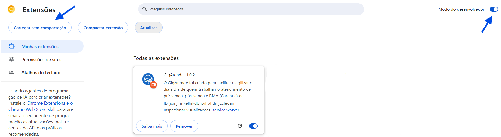

*Figura 1 - Instalação*

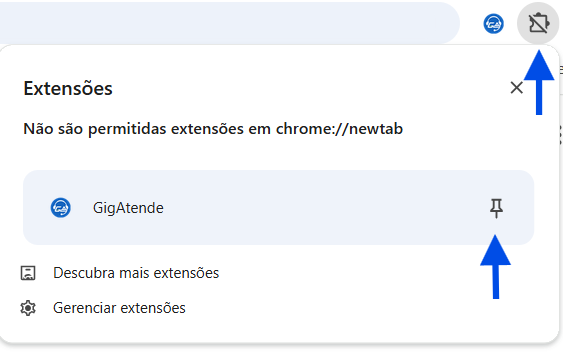

*Figura 2 - Fixando a Extensão*

---

### 2. Criando Categorias (Deixando tudo organizado)
Como teremos várias mensagens, é super importante separá-las em pastas (Categorias).
Para acessar o painel de controle, clique no ícone da extensão no topo e depois em **Abrir Administração**.

*Figura 3 - Abrindo a Administração*

1. No menu superior da Administração, clique em **Categorias**.
2. Clique no botão **Nova Categoria**.
3. Dê um nome (ex: 'Dúvidas Técnicas', 'Saudações').
4. Escolha um ícone e uma cor para identificação rápida.
5. Deixe a chave 'Categoria ativa' ligada e clique em Salvar.

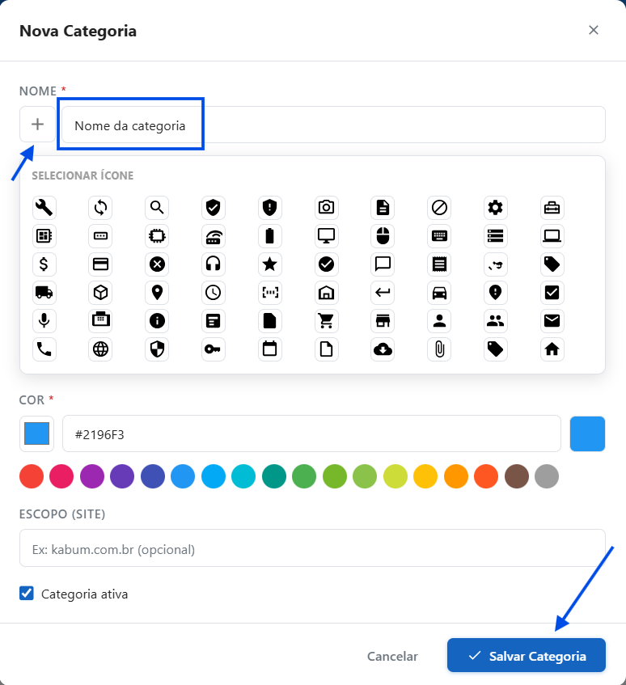

*Figura 4 - Criando uma Categoria*

---

### 3. Criando a sua Primeira Mensagem (O Modelo)
Com a pasta pronta, vamos cadastrar os textos.

1. No menu superior, clique em **Mensagens** e depois em **Cadastrar mensagem**.
2. **Título**: Escolha um nome claro (ex: 'Saudação Inicial').
3. **Ícone e Categoria**: Selecione um ícone e vincule à categoria criada.
4. **Tags**: Digite palavras-chave separadas por vírgula para facilitar buscas.
5. **Conteúdo**: Digite o texto exatamente como quer enviar para o cliente. A Prévia mostrará como ficará na tela.
6. Clique em Salvar.

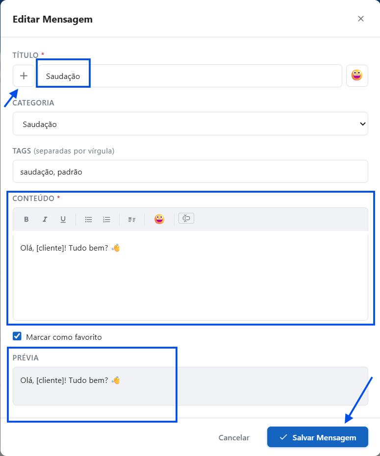

*Figura 5 - Cadastrando Mensagem*

---

### 4. Ativando o GigAtende no Site de Atendimento
Abra o site ou sistema que você usa para falar com os clientes.

1. Clique no ícone do GigAtende no topo do Chrome.
2. Habilite o recurso **Ativar neste site**.
3. Um botão flutuante aparecerá no canto da tela.

> ⚠️ **Dica de Ouro:** Clique primeiro dentro do campo onde você digitaria a resposta, e só depois clique no botão flutuante do GigAtende e escolha sua mensagem.

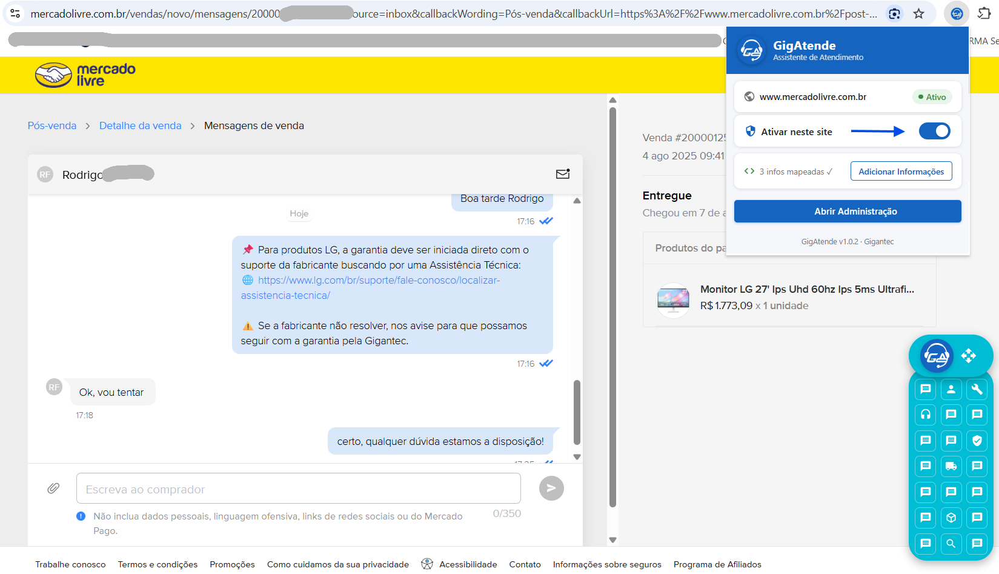

*Figura 6 - Habilitando um Site*

---

### 5. Favoritando Mensagens Rápidas
Deixe as mensagens mais usadas a um clique de distância.

1. Na tela de **Mensagens** (Administração), clique na estrelinha ao lado da mensagem para torná-la **Favorita**.
2. Ao abrir o botão flutuante no seu atendimento, essas mensagens aparecerão no topo, na seção 'Mensagens Rápidas' (apenas com o ícone).
3. Você pode escolher até 21 mensagens para este atalho rápido! Pouse o mouse sobre o ícone para ver a legenda.

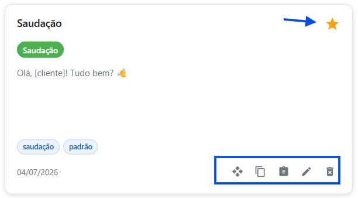

*Figura 7 - Mensagens Favoritas*

---

### 6. Placeholders: A Mágica de Preencher o Nome Sozinho
A extensão preenche o nome do cliente sozinho, você só precisa "mostrar" onde essa informação fica no site.

1. No site de atendimento (com a extensão ativada), clique no ícone do GigAtende no topo.
2. Clique no botão azul **Selecionar informações**.
3. Leve o mouse até o nome do cliente na tela (um retângulo azul aparecerá) e clique.
4. Selecione a opção **Nome do cliente** (código `[cliente]`).
5. Pronto! Você pode repetir o processo para mapear o Pedido (`[venda_pedido]`) e o Produto (`[produto]`). *Esta configuração é feita apenas uma vez por site!*

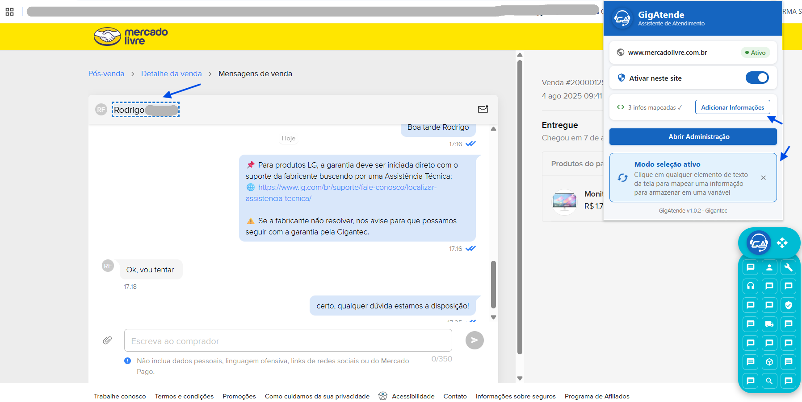

*Figura 8 - Mapeando Informações*

---

### 7. Usando Placeholders nas Mensagens
Com a extensão lendo os dados, coloque as variáveis nos seus textos.

1. Ao criar ou editar uma mensagem, clique no botão de **Variáveis/Placeholders** (ao lado dos emojis) na caixa de 'Conteúdo'.
2. Selecione `[cliente]`. O texto ficará: *'Olá [cliente], como posso ajudar hoje?'* e preencherá automaticamente na hora do envio.
3. Se precisar, você pode criar placeholders personalizados específicos para cada site!

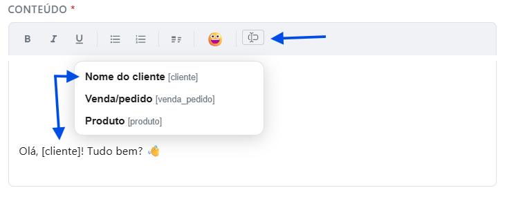

*Figura 9 - Inserindo Variáveis*

---

### 8. Gerenciando os Sites na Administração
Na aba **Sites** da Administração, você visualiza os domínios mapeados.

1. Adicione, edite ou delete sites facilmente.
2. Para cadastrar um site manualmente, insira apenas o domínio (ex: *atendimento.empresa.com.br*).
3. Na seção de edição, você pode criar placeholders personalizados manualmente.

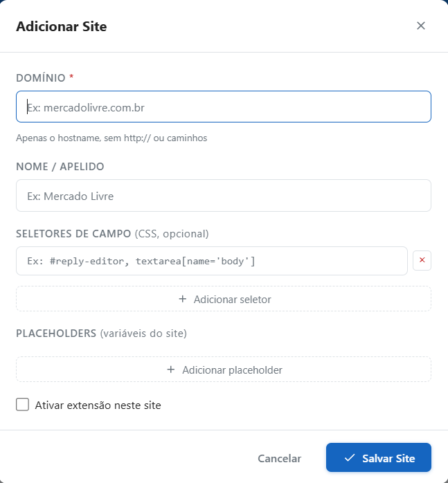

*Figura 10 - Gerenciamento de Sites*

---

### 9. Configurações e Tema
Na aba **Configurações**, mude o tema da extensão e faça backup das suas configurações.

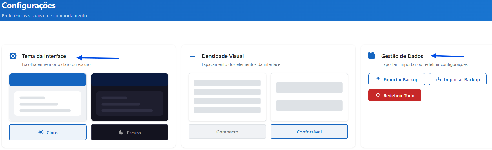

*Figura 11 - Tela de Configurações*

---

### 10. Backup: A Salvação e o Compartilhamento
Exporte ou importe seus dados a qualquer momento pelos botões no topo da Administração.

- **Troca de computador:** Exporte no PC antigo e importe no novo para restaurar tudo!
- **Trabalho em equipe:** Exporte seu banco de mensagens e compartilhe com colegas para padronizar o atendimento.

> ⚠️ **Atenção:** O arquivo `.json` exportado nunca deve ser editado fora da extensão para evitar corrompimento de dados. Mantenha seus backups atualizados em local seguro (como Google Drive).

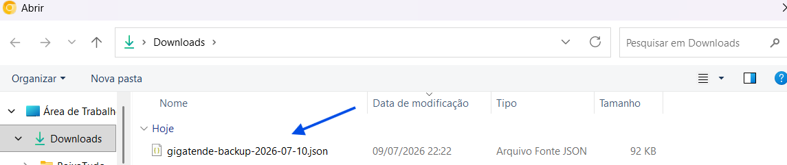

*Figura 12 - Exportando e Importando Mensagens*

---

## 🛠 Info Técnica
- **Versão:** 1.3.1
- Extensão em Vanilla JS sem frameworks.
- Injeção ocorre via API Range para contenteditable ou seleção nativa de textarea.
- Mitigação contra XSS através de parser DOM local e sanitização manual.
- Zero impacto de renderização (FPS) — não utiliza MutationObserver no documento todo.
- **Permissões Necessárias:**
  - `storage`: Para gravar mensagens no navegador.
  - `activeTab / tabs`: Para injetar o botão flutuante e scripts nos sites ativos.

---

## 🤝 Contato e Projeto

**Projeto desenvolvido em Vibe coding por Raimundo A S Brigida**

- **LinkedIn:** [https://www.linkedin.com/in/raimundoalvesstb/](https://www.linkedin.com/in/raimundoalvesstb/)

---

## ⚖️ Licença

Este projeto é distribuído sob a PolyForm Noncommercial License 1.0.0.

**Você pode:**
- utilizar gratuitamente;
- estudar o código;
- modificar;
- criar versões derivadas;
- redistribuir mantendo esta licença.

**Você não pode:**
- vender este software;
- cobrar pelo seu uso;
- utilizá-lo em atividades ou produtos comerciais;
- incorporar total ou parcialmente este projeto em software comercial.

Para uso comercial, é necessário obter autorização expressa do autor.

Copyright © 2026 Raimundo A S Brigida.
